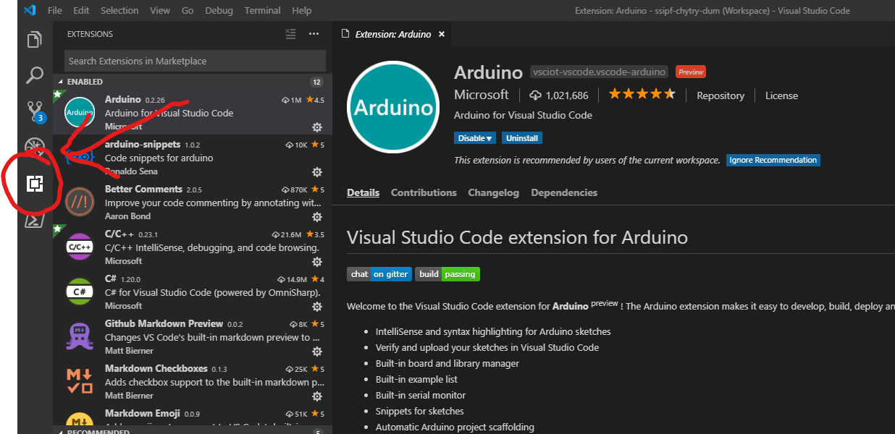

# Chytrý dům

Projekt je nakonfigurovaný pro vývoj ve [Visual Studio Code](https://code.visualstudio.com/), které má vůči klasickému Arduino IDE několik výhod, jako doplňování a barevné zvýrazňování kódu, větší přizpůsobitelnost a další...

## Konfigurace prostředí
##### Tyto kroky je potřeba provést po naklonování/stažení repozitáře na zařízení:

1) Pro vytvoření lokální konfigurace je třeba spustit soubor `nakonfigurovat-prostredi.bat`.

> Pro smazání lokální konfigurace lze použít soubor `smazat-konfiguraci-prostredi.bat`. <small><small>(Může se hodit v případě, že se vyskytne nějaká chyba v konfiguraci apod.)</small></small>

2) Soubor `nakonfigurovat-prostredi.bat` vytvoří v repozitáři několik lokálních souborů: 
    
    - `chytry-dum.code-workspace`, který lze otevřít ve Visual Studio Code
    
    - `.vscode/arduino.json`, ve kterém je uloženo nastavení "programátora" na `AVRISP mkII`, který je v době psaní tohoto návodu výchozí v Arduino IDE <small><small>(později při používání VS Code s rozšířením pro Arduino se do tohoto souboru uloží více nastavení)</small></small>
    - `.vscode/c_cpp_properties.json`, který obsahuje konfiguraci potřebnou pro správnou funkčnost IntelliSense (automatické doplňování apod.)

3) Ve spuštěném VS Code otevřete Správce rozšíření (viz. obrázek) a nainstalujte rozšíření `Arduino` a po jeho úspěšné instalaci VS Code zavřete a znovu otevřete.

> Lokální konfigurací/lokálními soubory je v tomto případě myšleno, že nejsou uloženy v gitu, ale pouze na aktuálním zařízení.
